# 🌐 Alpha Smart Router

> **A real-time, lock-free, embedded-friendly smart routing simulator**  
> Built in C++23, targeted for Linux, with planned QNX support to leverage real-time capabilities.

🎹 *Name inspired by “Alpha” by Vangelis — because if routers could play synths, they’d probably sound like this. 🎶*

---

## 📌 Project Timeline
Project incubated locally from September 2024 with ongoing design and coding.
First public baseline release (v0.1.0) in October 2025. Development ongoing — see CHANGELOG.md for release history.

👉 See [CHANGELOG.md](CHANGELOG.md) for full project evolution.

---

## 🚀 Overview
Alpha Smart Router is a simulation of a smart network router, designed with **real-time and embedded constraints** in mind.

## Roadmap


## 🚦 Reliability Philosophy
Routers never aim for **zero packet loss** — they aim for **loss under control**.
- Data-plane level: bounded queues and fast failure signals (no unbounded latency).
- Control-plane level: QoS prioritization, multipath load balancing, and failover policies keep impact predictable.

- Lock-free, preallocated data paths for predictable latency
- Bounded memory usage with packet pools and circular queues
- Cache-friendly design for high throughput
- Policy-driven intelligence (QoS, failover, multipath — extensible)
- Observability & debuggability (structured logging, counters, health probes)

---

## 🏗️ Architecture at a Glance

### 1. **Memory Layer (`alpha::mem`)**
- **packet** — fixed-size packet struct with metadata/payload
- **packet_pool** — preallocated pool, bounded, no heap use on hot path
- **spsc_queue** — lock-free single-producer/single-consumer circular buffer

---

### 2. **Routing Core (`alpha::routing`)**
- **path_selection** — round-robin, flow-hash, and latency-aware policies
- **qos_policy** — DSCP mapping, latency/jitter/loss thresholds and scoring
- **failover_policy** — health-aware path switching with hold timers and return-to-primary logic
- **ingress_selector** — deterministic (RR/hash) or route-informed ingress choice
- **service_registry** — RCU-based registry of services and points of presence (PoPs)
- **bgp_oracle / bgp_oracle_sim** — simulated oracle for best-path selection
- **policy_binding** — seqlock-based binding between CP (control plane) policies and DP (data plane) fast path

---

### 3. **Config & Runtime Layer (`alpha::config`, `alpha::rt`)**
- **config_loader** — default QoS/Failover/Ingress configs (planned TOML/JSON parsing)
- **constants** — thresholds, DSCP values, weight defaults
- **runtime profiles** — Linux (`rt_linux.cpp`) and QNX (`rt_qnx.cpp`) stubs for OS abstraction

---

### 4. **Concurrency & Synchronization Model**
- **Control Plane (CP):** single-writer assumption (updates metrics, registry, policies)
- **Data Plane (DP):** multi-reader worker threads on lock-free hot path
- **Mechanisms:**
    - RCU snapshots (`ServiceRegistry`)
    - Seqlock slots (path metrics, policy bindings)
    - Atomic counters & stateless hash mixing (ingress selection)
- **Roadmap:** extend to multi-writer CP using lock striping, RW-locks, or hazard-pointer RCU

---

### 5. **Observability Layer**
- Structured counters, logging hooks, and health probes
- Extensible to external monitoring (Prometheus, eBPF, tracing)

---

### 6. **Application Layer (`apps/`)**
- **router_app** — main router executable (pipeline + routing policies)
- **ping_tool** — RTT testing utility and demo traffic generator

---

## 🧩 Technical Architecture Diagrams

### Overall System Architecture
[](docs/diagrams/architecture.svg)

### Data Plane Packet Flow
[](docs/diagrams/packet_flow.svg)

### Memory Management (Real-Time Safe)
[](docs/diagrams/mem_overview.svg)


## ✅ Validation & Benchmarking
- Unit tests (GoogleTest) are included under `tests/` — covering memory primitives, routing policies, and QoS.
- Placeholders for failover and ingress tests are in place, scheduled for v0.2.0.
- Benchmarks (`bench/spsc_bench.cpp`) - Measures round-trip throughput for `push+pop` pairs using two payload types:
*   1) `int` (trivially copyable)
*   2) `std::unique_ptr<int>` (move-only)

---

## 🔮 Future Extensions
- Full config parsing (TOML/JSON)
- Multi-writer/multi-reader synchronization model
- Advanced QoS/Failover logic with health-driven policies
- QNX runtime profile with hard real-time guarantees
- Extended benchmarks for throughput/latency scaling

---

## 📂 Repository Structure

```text
alpha-smart-router/
├── include/alpha/         # Public headers
│   ├── mem/               # Memory primitives (packet, pool, SPSC queue)
│   ├── routing/           # Routing core (path selection, policies, registry, oracle)
│   ├── config/            # Config loader and constants
│   ├── os/                # Runtime profiles (Linux, QNX)
│   └── obs/               # Metrics and logging interfaces
├── src/alpha/             # Source implementations (mirrors include/)
│   ├── mem/
│   ├── routing/
│   ├── config/
│   ├── os/
│   └── obs/
├── apps/                  # Executables
│   ├── router_app/        # Main router pipeline app
│   └── ping_tool/         # RTT testing tool
├── tests/                 # Unit tests (GoogleTest)
│   ├── test_mem/          # Tests for SpscQueue<T> (owning, RT) and PacketPool
│   └── test_routing/      # Tests for ServiceRegistry RCU semantics + heterogeneous lookup
├── benchmarks/                  # Benchmarks (Google Benchmark)
│   └── spsc_bench.cpp           # Measures round-trip throughput for push+pop (copyable & move-only)
├── docs/
│   ├── diagrams/                        # Final design diagrams (SVGs)
│   │   ├── architecture.svg             # Layered system blueprint
│   │   ├── packet_flow.svg              # Data plane packet flow
│   │   ├── memory_overview.svg          # Data plane memory management
│   │
│   └── verification/                    # Validation and test coverage
│       └── verification_plan.md         # Maps requirements → tests → results
├── CMakeLists.txt        # Build configuration
├── README.md             # Project documentation
├── CHANGELOG.md          # Project evolution log
└── .gitignore            # Git ignore rules
```
---

## 🔧 Quick Start

### Environment

**Toolchain**
- CMake ≥ 3.20
- Ninja (presets expect it)
- Conan v2
- C++23 compiler:
  - macOS: AppleClang 15+ (Xcode Command Line Tools)
  - Linux: Clang 16+ or GCC 13+

**Verify**
```bash
cmake --version
ninja --version
conan --version
c++ --version
```

**macOS**
```bash
# Xcode command line tools (compiler, headers)
xcode-select --install

# Build tools
brew install cmake ninja conan

# (Optional) Newer LLVM/Clang if you want:
# brew install llvm
# export CC="$(brew --prefix llvm)/bin/clang"
# export CXX="$(brew --prefix llvm)/bin/clang++"
```

**Conan (first run)**
```bash
conan profile detect || true   # generates a default profile matching your host
```

### Debug (with presets + Conan)

```bash
# 1) Deps + toolchain into build/Debug/
conan install . --output-folder=build/Debug --build=missing -s build_type=Debug

# 2) Configure (uses CMakeUserPresets.json)
cmake --preset Debug            # add -DALPHA_ENABLE_BENCHMARKS=OFF to skip benches

# 3) Build
cmake --build --preset build-Debug -j

# 4) Run all tests
ctest --preset test-Debug --output-on-failure

# 5) (optional) Run specific suites
ctest --preset test-Debug -R test_mem     --output-on-failure
ctest --preset test-Debug -R test_routing --output-on-failure

# 6) (optional) Benchmark (if built)
./build/Debug/spsc_bench

# 7) (optional) Router app (placeholder)
./build/Debug/router_app
```

### Notes
- Presets assume Ninja; install it or switch the generator in CMakeUserPresets.json.
- If (`ctest`) says “No tests were found”, reconfigure & build tests:
```bash
  cmake --preset Debug -DALPHA_ENABLE_TESTS=ON
  cmake --build --preset build-Debug --target test_routing test_mem -j
  ctest --preset test-Debug --output-on-failure
```
- Optional CMake toggles on the configure step:
```bash
  cmake --preset Debug -DALPHA_ENABLE_TESTS=OFF
  cmake --preset Debug -DALPHA_ENABLE_BENCHMARKS=OFF
```

 